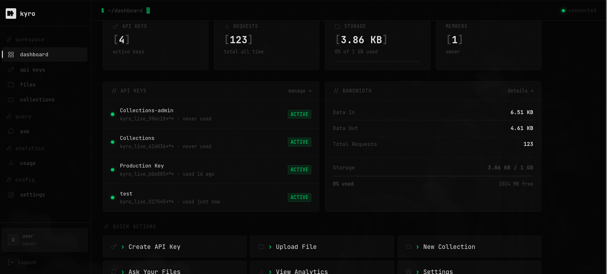

<p align="center">
  
</p>

<h1 align="center">Kyro</h1>

<p align="center">
  Self-hosted document storage and RAG API. Upload files, extract text, embed chunks, and ask questions across your documents — all running on your own infrastructure.
</p>

<p align="center">
  Built for teams that can't send their data to third-party AI providers.
</p>

<p align="center">
  <a href="https://kyro-henna.vercel.app/">Docs</a> ·
  <a href="https://github.com/Kyroinfra/kyro-sdk-typescript">TypeScript SDK</a> ·
  <a href="https://kyro-henna.vercel.app/docs#sdk">SDK Docs</a>
</p>



## Prerequisites

- [Docker](https://docs.docker.com/get-docker/) and Docker Compose
- [Ollama](https://ollama.com) running with your chosen models — can be on the same server or a separate GPU machine

## Setup

**1. Clone and configure**

```bash
git clone https://github.com/Kyroinfra/Kyro
cd Kyro
cp .env.example .env
```

Edit `.env` and fill in your values:

```env
POSTGRES_USER=kyro
POSTGRES_PASSWORD=changeme
POSTGRES_DB=kyro
REDIS_PASSWORD=changeme
JWT_SECRET=changeme

PGADMIN_EMAIL=admin@example.com
PGADMIN_PASSWORD=changeme

# Point this at your Ollama instance
OLLAMA_URL=http://host.docker.internal:11434

# Models — these must already be pulled in Ollama
EMBEDDING_MODEL=nomic-embed-text
CHAT_MODEL=llama3.2
```

**2. Pull your Ollama models**

```bash
ollama pull nomic-embed-text
ollama pull llama3.2
```

**3. Start**

```bash
./scripts/prod.sh
```

Or manually:

```bash
docker compose \
  -f compose.yml \
  -f compose.prod.yml \
  --env-file .env \
  up -d
```

The API will be available at `http://localhost/api/v2`. Migrations run automatically on first start.

## Architecture

| Service | Description |
|---|---|
| `api` | REST API — 3 replicas behind nginx |
| `worker` | Text extraction and embedding worker — 2 replicas |
| `webhook-worker` | Webhook delivery worker |
| `postgres` | PostgreSQL with pgvector |
| `redis` | Job queue and rate limiting |
| `nginx` | Reverse proxy |

Ollama runs separately and is referenced via `OLLAMA_URL`. For production, a dedicated GPU server for Ollama is recommended.

## Using the API

Create an account and generate an API key via the REST API, then use the [TypeScript SDK](https://github.com/Kyroinfra/kyro-sdk-typescript) or call the API directly.

```bash
# Health check
curl http://localhost/health
```
Create a Scoped API key to use with SDK

For the full API reference and SDK documentation visit [docs](https://kyro-henna.vercel.app/docs).

> **WIP**
